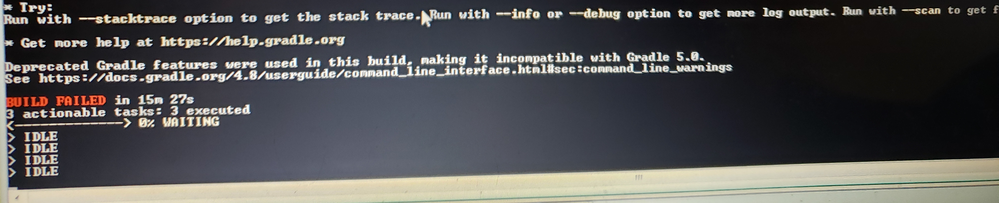

# Build Instructions

Although this mod is meant to be opened and manipulated inside of IntelliJ, you can still compile the mod using the command line.

## First, you must get this code onto your machine
Using [Git](https://git-scm.com/) installed on your computer, open your Terminal/Command Line, chose a folder you want the code to go to, and clone this repository .
```
git clone https://github.com/orangeadam3/terra121.git
```
### REMEMBER TO HAVE MINECRAFT SETUP WITH THE CORRECT PREREQUISITES FROM THE [README](README.md)!!!!!

## Second, build the mod 
Make sure you are inside of the '*terra121*' folder, start the building process, and watch the beautiful technical jazz fly across your console. 


If you are on Windows:
```
gradlew.bat build
```
If you are on macOS or Linux, you may need to define executability:

```bash
sudo chmod +x gradlew
```

then you can use:

```
./gradlew build
```
The build time will depend on the speed of your internet connection and the speed of your processor.

**The build finished properly if you reach: **


or until it says 
```
BUILD SUCCESSFUL in #s
```
**or it did not finish properly if you reach:**



or it says

```
BUILD FAILED in #s
```
We have [some instructions](TROUBLESHOOT.md) for some common Troubleshooting solutions, however if those don't help, please feel free to report the issue on this repository.

##  Find and move the mod
Although it would be straightforward to find the mod in the repository's *build* folder, that is not the case.

The mod is found inside the **CubicWorldGen** folder, under **its** build folder, in a folder labeled *libs*.

Meaning you should find the mod in this directory

```bash
\terra121\build\libs
```


The correct file ends with ''**.jar**''. (Do not use the sources.jar) Move that file to your Minecraft Forge (server and/or client) mod folder, and generate a new world with the 'Planet Earth' World type, and try out some of our [Cool Earth Locations](COOL_LOCATIONS.md) to check out in Minecraft.

**Instructions to properly load the mod on a Minecraft Forge server can be found in the [Server Run instructions](USING_SERVER.md)**

**Instructions to properly load the mod on a Minecraft Forge server can be found in the [Server Run instructions](USING_SERVER.md)**


**FRIENDLY REMINDER THAT WHEN YOU CREATE THE WORLD TO ENABLE CHEATS OR HAVE OPERATOR POWER ON YOUR SERVER, YOU WILL NEED IT!!!** (You do not spawn near any [real-world location](https://www.youtube.com/watch?v=bjvIpI-1w84))

