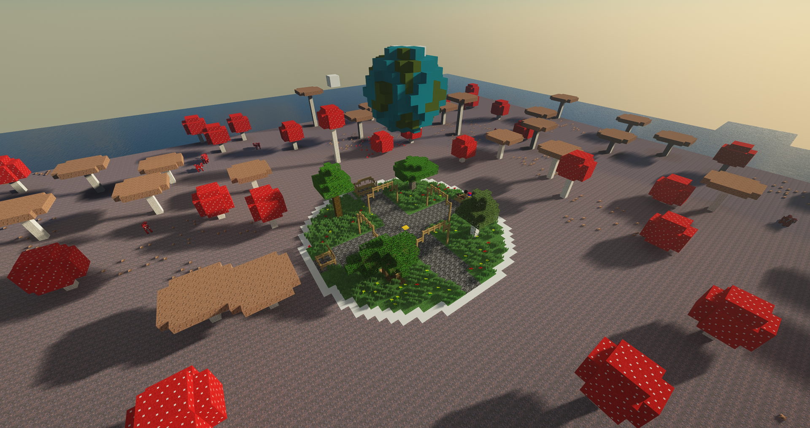
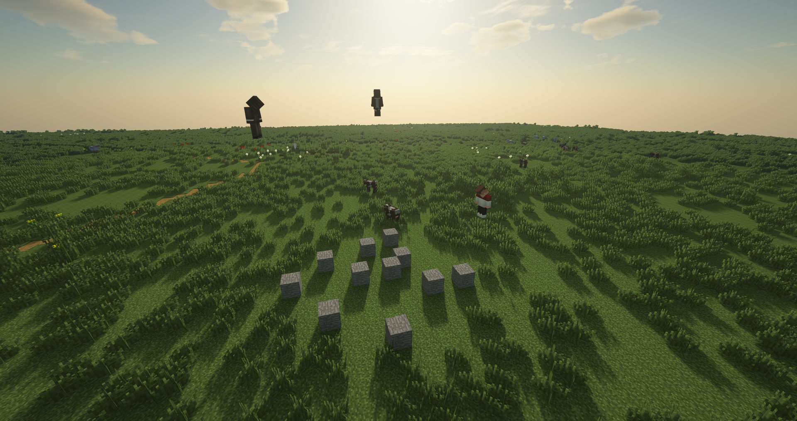
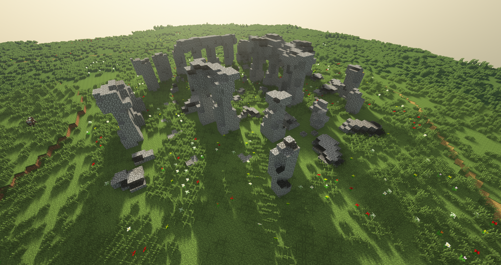
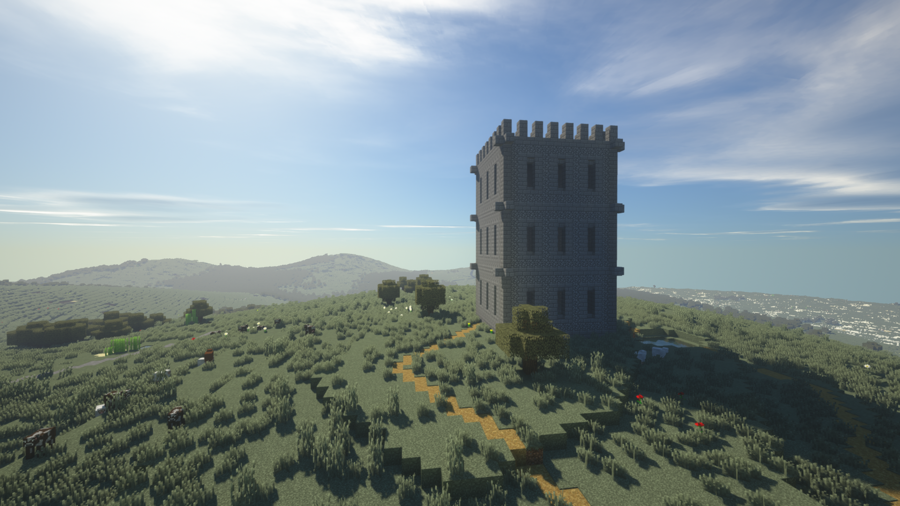
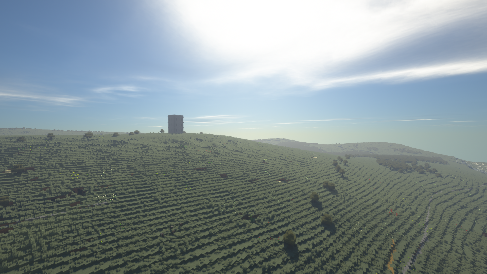
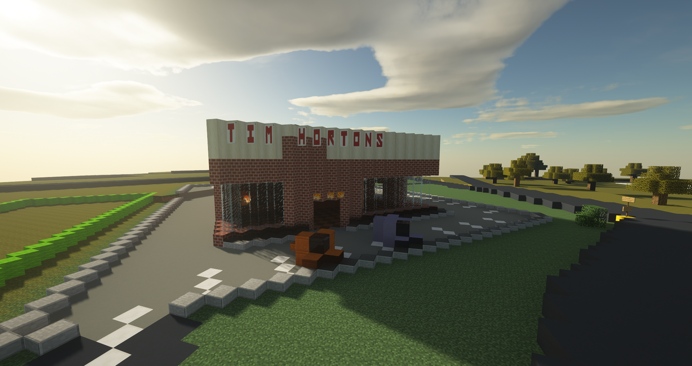
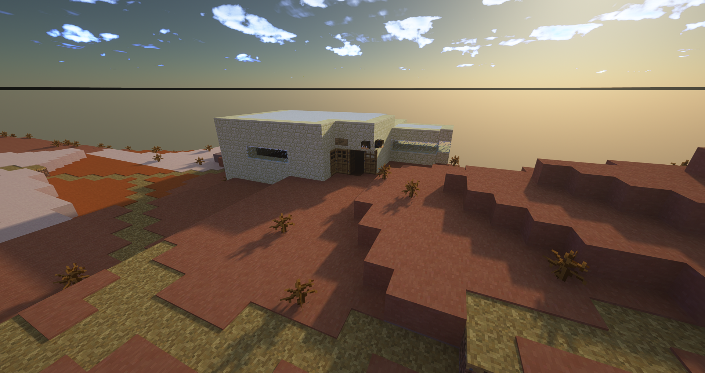

# Creations showcase

### We love seeing people make videos, content, and creations with our mod, this is a dedicated page to those creations and showing our appreciation.

Check out the mod showcase by PippenFTS, a Minecraft ethusiast who posted a Minecraft Documentary on playing Minecraft on a 1:1 scale

(Clicking the image will take you to the video link)

Check out the mod showcase by [ArcticKnight98](https://www.youtube.com/channel/UCwKMsRHWwYo5SJqpNbaBG1w), an avid follower of our mod, and has been investing a lot of time in our mod, working on adding new features, and giving ideas for stuff to be added.

Check out a mod showcase by [Baccar Wozat](https://www.youtube.com/channel/UClbmNgZmGahCDKcs8_aMN0A), Administrator and Moderator on the [Cubic Chunks Discord](https://discord.gg/kMfWg9m), and has been interested in the development of our mod since the beginning.

Improved Null Island, including earth, moon, and sun models. Created by Terra 1-to-1 developers (shejan0, TheAtomBomb92), Wozat, MineCrak, and FyreBurns

LukeMC_, Jak2000, and OverFallen starting their efforts to build Stonehenge in Minecraft 1:1 (on server)

This is their finished version, using a base model from the user CuriousPlughole, with slight edits to fix scale. (on server)

A Castle in Slovenia created by user ArcticKnight98

Tim Hortons built in Canada by FyreBurns (on server)

Yavapai Geological Museum by shejan0

