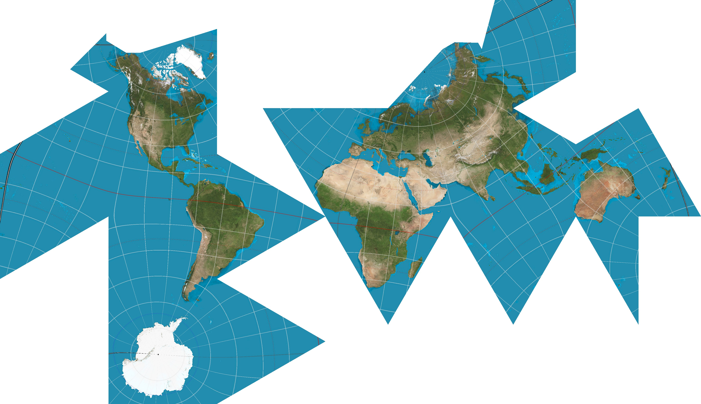

# Map Projections

It is mathmatically imposible to create a perfect map of a globe and minecraft is inherently flat. Therefore, some distortion must be made when creating the world. The way this distortion is expressed can vary based on what properties the user wants. This is generaly a trade-off between shape accuracy and area accuracy. Any projection can be described as two equations relating longitude and latitude to the 2D x/y coordinates.

```
λ = longitude
φ = latitude
x = x-coordinate
y = y-coordinate
```

## Equirectangular
Speed: Fastest

Shape Distortion: Medium

Area Distortion: Medium

```
x = λ
y = φ
```


This is just a simple projection that does no transformation on the latitude and longitude. This is the fastest and simplest projection. It is the default projection, and has fairly decent shape and area preservation as long as you are not near the poles.

[wikipedia](https://en.wikipedia.org/wiki/Equirectangular_projection)

## Sinusoidal
Speed: Fast

Shape Distortion: High

Area Distortion: No distortion

```
x = λcosφ
y = φ
```


This is an equal area projection so any region will have the exact same area in the game as they do on earth. This comes at the cost of high shape distortion This projection is fairly fast will give you the best performance of any equal area projection. (except mabye Gall-Peters (not supported currently))

[wikipedia](https://en.wikipedia.org/wiki/Sinusoidal_projection)

## Mercator
Speed: Fast

Shape Distortion: No distortion

Area Distortion: High

```
x = λ in radians
y = log(tan(½φ + 45°)))
```


This is the most common projection and is similar the ones used on openstreetmap, google maps, and most modern maps. The shapes (technically the angles) are perfect but the areas are famously way off near the pole (Greenland is not the same size as Africa, dispite what this map says). It is also fairly slow so may lag more than simpler projections.

[wikipedia](https://en.wikipedia.org/wiki/Mercator_projection)

## Equal Earth

Speed: Medium

Shape Distortion: High

Area Distortion: No distortion


where


This is a relatively new projection. It maintains area but also tries to have less shape distortion than Sinusoidal. It was invented by Bojan Šavrič, Bernhard Jenny, and Tom Patterson in 2018. The formula is by far the most complicated and slowest of those listed above. (Reversing it requires solving a 9th degree polynomial)

[wikipedia](https://en.wikipedia.org/wiki/Equal_Earth_projection)


## Airocean

Speed: Very Slow

Shape Distortion: Low

Area Distortion: Low


A relatively complex projection based on [Buckminster Fuller's Dymaxion map](https://en.wikipedia.org/wiki/Dymaxion_map). It projections the earth onto an icosahedron (a shape with 20 sides) and then unfolds that shape into it's net. The shape is split in such a way so that the map is discontinous only over the ocean.

This map shows a more complete image of the earth's landmasses with places like Antarctica shown completely in one appropriately-sized region on the map. This map does not have perfect shape or area distortion but has very low overall distortion. The downside is that it is very very slow to compute compared to the above projections. Also north is not always in the same direction, unlike the above projections.

## Conformal Estimate Airocean & Build The Earth (BTE) Projections 

Speed: Very Slow

Shape Distortion: Almost None

Area Distortion: Medium

These projections are based [#Airocean] & Daniel “daan” Strebe's [Dymaxion-like conformal projection](https://map-projections.net/single-view/dymaxion-like-conformal). With Dann's help and that of the Build the Earth projection team, we were able to [develop the projection in just over a week](https://www.youtube.com/watch?v=0eyyuNvKNzw). We used a dataset pulled from dann's projection to nearly replicate it's conformal properties, meaning there is almost no shape distortion.

### Build The Earth projection
The difference between the Conformal Estimate Airocean & Build The Earth Projections is that the Build The Earth Projection flips the eastern hemisphere to partially correct the fact that north is not always the same direction, at least in the popular build areas of Europe & The Americas. It is the official projection of the [Build The Earth](https://buildtheearth.net/) project.


