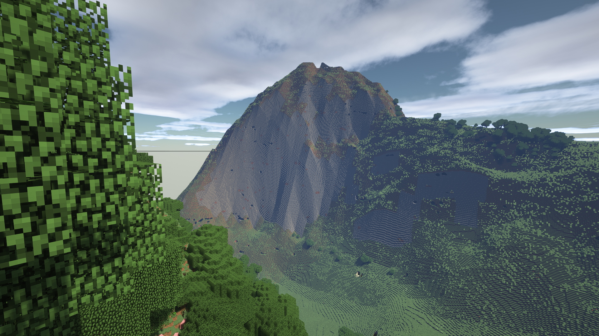

# Terra 1 to 1 Minecraft Earth Project
**Current build status:** [](https://jenkins.altillimity.com/job/Terra/)

### Developed by orangeadam3
### Co-Developed and images by shejan0 
### Submod of [CubicChunks](https://github.com/OpenCubicChunks/CubicChunks) and [CubicWorldGen](https://github.com/OpenCubicChunks/CubicWorldGen/) from the [OpenCubicChunks](https://github.com/OpenCubicChunks) project. 

Special thanks to other developers and community who have helped us along the way: Barteks2x, KdotJPG, Wozat, MineCrak, FyreBurns, and so many more. This mod wouldn't be anywhere without you.



Barranca del Cobre (Copper Canyon), Chihuahua, Mexico

## What is it?

Terra 1-to-1 is a Minecraft Forge mod that adds a new world generation type to Minecraft that utilizes public online datasets to generate the earth's structures and features (in Minecraft) without any unfamiliar blocks or biomes at a 1 to 1 scale. 

The main features available are terrain, biomes, trees, and roads, all pulled from real global data sources.

The mod is constantly being worked on and being updated as we add more features and fine tune the mod to achieve a better connection between the real world and the world of blocks.

Feel free to check in to this page, and our stream (down below) to always see what is cooking and coming out.

The latest version can always be [compiled](BUILD_INSTRUCTIONS.md) from [Github](https://github.com/orangeadam3/terra121) or downloaded from our unofficial [Jenkins CI](https://jenkins.altillimity.com/job/Terra/), which may have features not yet available in official releases on CurseForge. (Warning, maybe unstable)

## Feature List

- Concrete Roads, Stone Brick Minor Roads, and Grass Pathways from [OpenStreetMap](https://www.openstreetmap.org/)
- (mostly) Accurate elevation and biome placement using public terrain datasets.
- Procedural Tree placement based on a High Resolution Forest Cover dataset.
- Simple Oceans based on elevation with (mostly) accurate depths (this will be improved with the coming Update Aquatic)
- "Customize World" GUI that does not require MalisisCore
  - Custom [map projections](PROJECTIONS.md) (such as Equirectangular, Sinusoidal, Web Mercator, or EqualEarth)
  - Enable or Disable roads (this can also be done by disabling structures)
  - Enable or Disable experimental options such as smooth blending (Thanks to [KdotJPG](https://github.com/KdotJPG) for the code)
- Teleport by latitude and longitude using "/tpll latitude longitude \[elevation\]"
  - Use the decimal latitude and longitude format (for example,  "/tpll 36.0660 -112.1172" not "36°03'57.6"N 112°07'01.9"W")
  - If elevation is left blank, it will place you at the surface at that location
- Ores spawn just below surface (so you don't have to dig over 8000 blocks down to find diamond's if you are on top of Mt. Everest)
- Caves, Dungeons, and other standard underground features are still available and procedurally generated using CubicWorldGen as a baseline

## How is it done?

**CubicChunks**, first of all, adds a 3rd dimensionality to the already existing Minecraft chunk system, allowing much more accessibility when it comes to vertical height (a must have when representing earth, since Mount Everests elevation of 8,848 meters and the oceans depth of 10,994 meters requiring a block limit way higher than measly 256 meters/blocks of vanilla)

**CubicWorldGen** is an extension mod to *CubicChunks* to allow generation of worlds with 3 dimensions of chunks rather than the 2 dimensional generation of standard Minecraft.

This mod generates the world using information from public datasets regarding terrain, trees, and human structures with 3 dimensional chunks.

It also stores soil type and climate data within the mod itself to help with (mostly) accurate biome classification

## What is the difference this and the between other earth models available in Minecraft?

Rather than being on a percentage scale of the actual world, such as 1:2000 the scale, this generator generates the world on a 1:1 scale (Approximately, actual scale varies based on latitude ). Every block is 1 meter of the real world in every dimension. Because of this, it can have more specific features such as roads and (in a future update) smaller rivers and other bodies of water.


**The heights of Mount Everest never felt so virtually high before.**

You can take a sneak peak at other world landmarks with our [Screenshot Showcase](PICTURES.md)

## Currently used APIs:

Elevations data is downloaded in real time from [AWS Terrain Tiles](https://registry.opendata.aws/terrain-tiles/). (© [Mapzen](https://www.mapzen.com/rights), and [others](https://github.com/tilezen/joerd/blob/master/docs/attribution.md))

Tree cover data is downloaded in real time from the [ARCGIS REST TreeCover2000 Image Server hosted by the World Resources Institute](https://gis-treecover.wri.org/arcgis/rest/services/TreeCover2000/ImageServer), originally from [Landsat 7 ETM+](http://glad.geog.umd.edu/) (Originally [CC BY 4.0](https://creativecommons.org/licenses/by/4.0/))

Road (and soon, water) data is acquired from [OpenStreetMap](https://www.openstreetmap.org/) under the [Open Database License](https://www.openstreetmap.org/copyright). It is downloaded in real-time using a public [Overpass API](http://overpass-api.de/) instance. (© OpenStreetMap contributors)

Climate (rain & temperature) data is from [The University of Delaware Center for Climatic Research's Climate Data Archive](http://climate.geog.udel.edu/~climate/html_pages/archive.html) (built into the mod)

Soil suborder data is from the [USDA Natural Resources Conservation Service's Global Soil Region Map](https://www.nrcs.usda.gov/wps/portal/nrcs/detail/soils/use/?cid=nrcs142p2_054013) (built into the mod)

### [More comprehensive copyright and source description](SOURCES.md)

### THIS MOD DOWNLOADS DATA IN REAL-TIME FROM THE INTERNET!!!!! IT WILL NEED A DECENT INTERNET CONNECTION, AND WILL NOT WORK OFFLINE!!! DO NOT USE WITH MOBILE DATA CONNECTIONS, UNLESS YOU HAVE UNLIMITED DATA!!!!


## Creation showcase

Check out the mod showcase by PippenFTS, a Minecraft ethusiast who posted a Minecraft Documentary on playing Minecraft on a 1:1 scale

[](https://www.youtube.com/watch?v=8_bW3ab8YAk)

(Clicking the image will take you to the video link)

Check out the mod showcase by [ArcticKnight98](https://www.youtube.com/channel/UCwKMsRHWwYo5SJqpNbaBG1w), an avid follower of our mod, investing a lot of time , working on adding new features, and giving ideas for stuff to be added.

[](https://www.youtube.com/watch?v=f6p7jjWffEw)

(Clicking the image will take you to the video link)

Check out the mod showcase by [Baccar Wozat](https://www.youtube.com/channel/UClbmNgZmGahCDKcs8_aMN0A), Administrator and Moderator on the [Cubic Chunks Discord](https://discord.gg/kMfWg9m), and has been interested in the development of our mod since the beginning.

[](https://www.youtube.com/watch?v=XJG1XXOdJcc)

(Clicking the image will take you to the video link)

-*Much love from orangeadam3 and shejan0* 😫😤😘 (I do not support the use of suggestive emojis -orangeadam3)

## 

## Public Server

### We now have a public server that you can test the mod without ever having to install it!!!! 

The server is currently hosted by Aang23 from the [Cubic Chunks Discord](https://discord.gg/kMfWg9m), originally hosted by FyreBurns, you will need **AT LEAST** Forge and CubicChunks installed on your machine to join (download information can be found in the Prerequisites below)!

Either Direct Connect or Add a new server with the following IP:

### terra.altillimity.com

This is also another work in progress, so permissions and things may change according to Aang23 or FyreBurns, we greatly appreciate the resources that Aang23 is placing to run this server for the public, and what FyreBurns placed in the past.

**If you cannot join, then most likely it is off, do not spam message Aang23 or us, check back at another time.**

**We cannot guarantee that the server will stay up to date with the latest version of the mod, it maybe a couple versions behind**

*Thank you Aang23, and FyreBurns for your efforts, much appreciated*

*- shejan0 and orangeadam3* 😘

## Prerequisites

- **REQUIRED**: [Minecraft Forge](https://files.minecraftforge.net/) for the corrective version of Minecraft of the mod (currently Minecraft 1.12.2, this mod is tested using 2847 and 2768)
- **REQUIRED**: Standard CubicChunks for the corrective Minecraft version of the mod.
  - [On GitHub](https://github.com/OpenCubicChunks/CubicWorldGen/) (releases may be out of date, but can be compiled)
  - [On CurseForge](https://www.curseforge.com/minecraft/mc-mods/cubicworldgen) (may be out of date)
  - (THE NEWEST VERSION OF THE CUBICCHUNKS MOD FOR ALL VERSIONS IS ALWAYS AVAILABLE ON THE [CUBIC CHUNKS DISCORD](https://discord.gg/kMfWg9m) under the **#info-new-cc** channel)
- **REQUIRED**: Standard CubicWorldGen for the corrective Minecraft version of the mod **VERSION 0.0.85.0 OR HIGHER IS HIGHLY RECOMMENDED**
  - [On GitHub](https://github.com/OpenCubicChunks/CubicWorldGen/) (releases may be out of date, but can be compiled)
  - [On CurseForge](https://www.curseforge.com/minecraft/mc-mods/cubicworldgen) (may be out of date)
  - (THE NEWEST VERSION OF THE CUBICCHUNKS MOD FOR ALL VERSIONS IS ALWAYS AVAILABLE ON THE [CUBIC CHUNKS DISCORD](https://discord.gg/kMfWg9m) under the **#info-new-cc** channel)
- Recommended: [Malisis Core](https://www.curseforge.com/minecraft/mc-mods/malisiscore):  (The Planet Earth generation at the current moment does not have any support for Malisis, and is a future plan, but the original generation methods inside of CubicWorldGen do support Malisis)

**You must have all required mods installed for the Planet Earth generation to work!!!**

### CubicWorldGen 0.0.85.0 or later is HIGHLY recommended, as it has changes made that no longer causes conflicts with CubicWorldGen's default "Custom Cubic" generator, with the Terra 1-to-1 Planet Earth generator. 

### (Users who have standard Custom Cubic worlds with earlier CubicWorldGen versions and load Terra 1-to-1, might have broken generation on new chunks)!!!!

## Obtaining

We have compiled releases both on our [releases page](https://github.com/orangeadam3/terra121/releases), and on [CurseForge](https://www.curseforge.com/minecraft/mc-mods/terra-1-to-1-minecraft-world-project). 

However, some of you are little itchy peepers, and want the most recent version of the code, fresh with all the testing and beta, and broken stuffs. 

Luckily for pretty ol' you, here are the [building instructions](BUILD_INSTRUCTIONS.md).

You can also use builds from this [unofficial Jenkins CI](https://jenkins.altillimity.com/job/Terra/) that Aang23#7721 on the [Cubic Chunks Discord](https://discord.gg/kMfWg9m) created, this will always build the latest git master branch, so you don't have to build locally. (For the code that runs in Minecraft, make sure you get the file that does *not* end in **-sources.jar**)

- Love from shejan0 and orangeadam3 😤😖👏😘🤪 (still don't support the emoji -orangeadam3)

## Client Usage
After obtaining the binary (through a method listed above), when creating a new world, under the World Type, you will now have an option called "**Planet Earth**" which will allow you to generate a world using the new generation method.

Upon creation, You will spawn near or on (0,0,0) (a.k.a. 0°N, 0°E or [Null Island](https://www.youtube.com/watch?v=bjvIpI-1w84)), This region is placeholder, meant to be a type of testing zone and also to not spawn under the ocean. You would need to [teleport away to see somewhere meaningful](COOL_LOCATIONS.md).

## Server Usage
Instructions on how to use this mod in a Minecraft Forge Server can be found in our [Server Run Instructions](USING_SERVER.md)

## Using Custom Terra 1-to-1 TP command

With version 0.1.2, there is now a specific teleportation command that will automatically teleport to any standard decimal longitude and latitude:

```java
/tpll 36.0660 -112.1172 <custom height>
```


You will require operator or cheats power for this mod to work. This is implemented to work around the slight coordinate changes between different projections and orientations.

Leaving <custom height> blank will teleport you to elevation at that point, but setting it to a specific 

If you are using an older version, please look to our [older instructions](CALCULATECOORDS.md) on how to convert coordinates.

## Having issues?

This mod is in very early stages, and based on another mod that is also in early stages, so the possibility of issues is EXTREMELY high. However, we have some [Troubleshooting Tips](TROUBLESHOOT.md) that may help you in your endeavors to walk the earth in Minecraft.

However, if you find issues with the mod that are not resolved by doing things in the Troubleshooting page, then feel free to drop an [issue request](https://github.com/orangeadam3/terra121/issues).

## Known problems

This mod is still in development, and we are still resolving problems that we have found, and are being found, but here is a small list of some of the issues we know exist with this mod:

- As a rule, if it involves water it is probably broken, most of these problems should be fixed when the new water system is added (see Future Plans):
  - Areas on land but below sea level (ex. parts of The Netherlands, Caspian Sea Depression, Dead Sea region, Imperial Valley, etc.) are covered in water as if they were below sea level.
  - Coastlines are very broken/blockly, no non-accidental beaches
  - There are no above sea level rivers or lakes except for the standard procedural minecraft sources
  - Parts of the ocean make odd shapes or appear as land (ex. the prime meridian ridge near null island) (this may never be fully fixed as it is fundamentally caused by glitches in the terrain tile's barometry data, but it's severity can be reduced)
- The shape of biomes usually comes in 4-km blocks and the boundries are strait lines (this could be fixed with some smart interpolation and/or perlin noise)
- Biomes are classified incorrectly in some places (this could be improved by more thorough classification)
- Seed and Flower item drops will sometimes appear on roads (I honestly don't fully understand this one)

## Streaming? (we sure do)

So in order to get our mod onto [CurseForge](https://www.curseforge.com/minecraft/mc-mods/terra-1-to-1-minecraft-world-project#c6) (Hey to those who came over from CurseForge), we had to make a twitch account.

And because a Twitch account can stream to twitch, shejan0 has been thinking about streaming to Twitch with that account.

So give us a follow over at our [TheTerraDev](https://www.twitch.tv/theterradev) Twitch account.

[](https://www.twitch.tv/theterradev)

Also let shejan0#9517 know if you want us to host your stream on our page if you are using our mod in your stream.

## Future Plans

- Water based on actual river/lake/coastline locations from OpenStreetMap

- Update forest data from 2000 to 2012 (we found a newer one wooooo)

- Additional GUI features such as:
  - Changing the scale of the world (both vertical and horizontal)
  - Enabling esoteric features that might not be appreciated by everyone (ex. Road signs with names at evrey intersection).
  - Custom spawnpoint
  - Normal generation options like cave/ore frequency, etc.
  
- More commands to help you navigate the world by doing things such as:
  - Converting Latitude and Longitude to Minecraft coordinates (and vice versa)
  - Tell you things about the surrounding area such as street names and addresses

- An organic way to dealing with connecting both sides of the [antimeridian](https://en.wikipedia.org/wiki/180th_meridian) (maybe by simply teleporting the player from one side to the other?)

- A nether where 1 block in the nether = 1000 blocks (1km) in the overworld, instead of the vanilla 1:8 ratio. This would make legitimate globe spanning survival practical as traveling to the other side of the earth would only be 20,000 blocks in the nether (not exactly a short trip but better than the 20,000,000 blocks (2/3s the way to the World Border/Farlands) that it would take in the overworld)
