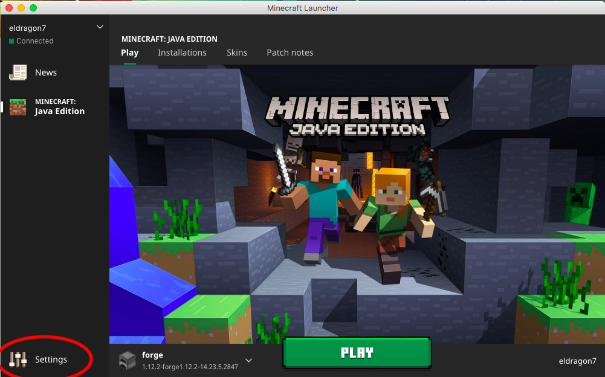
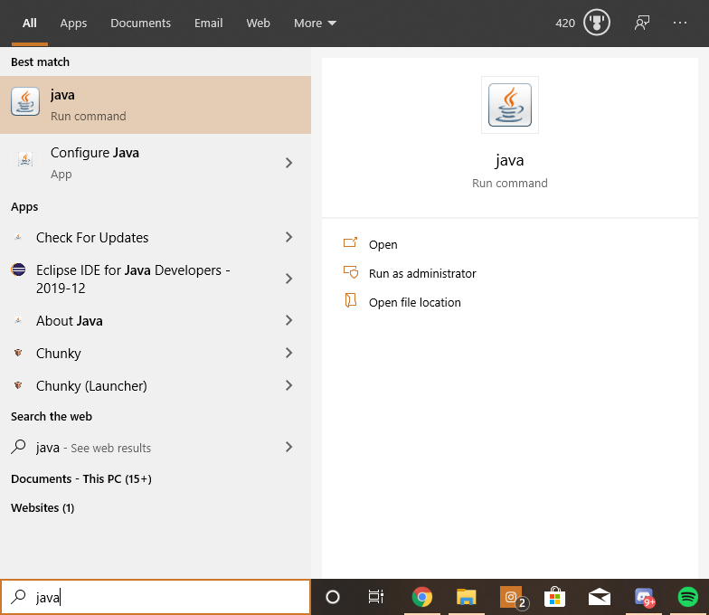
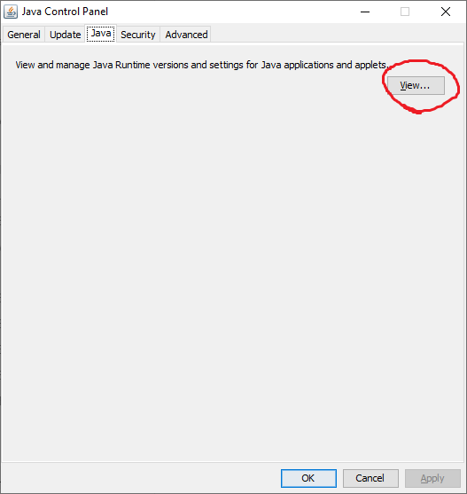
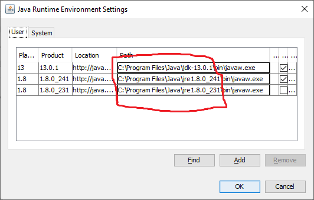
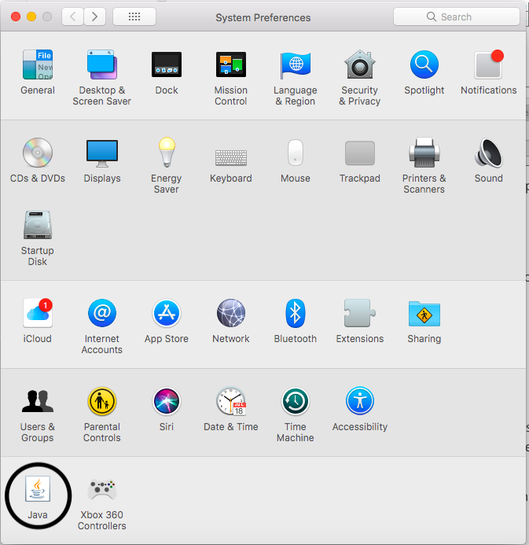
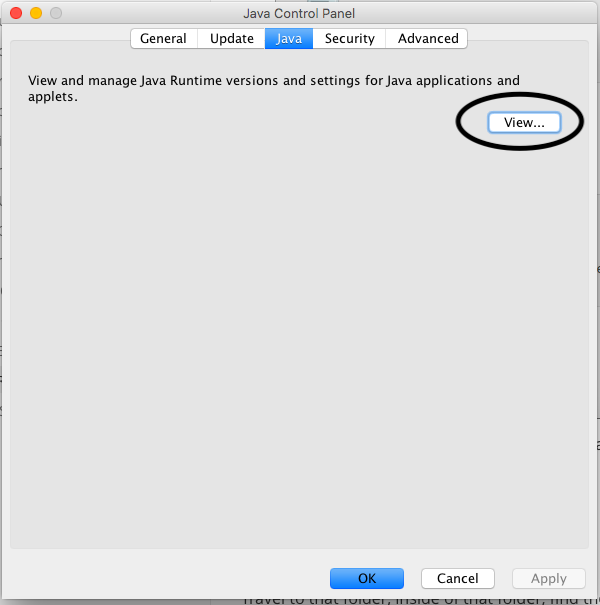
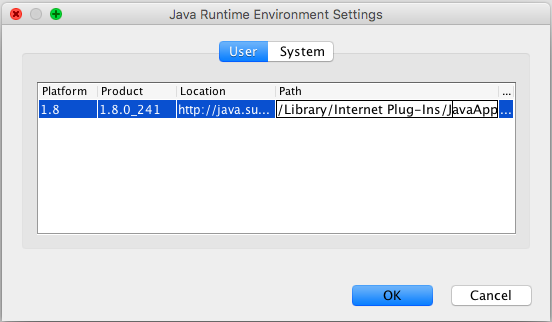
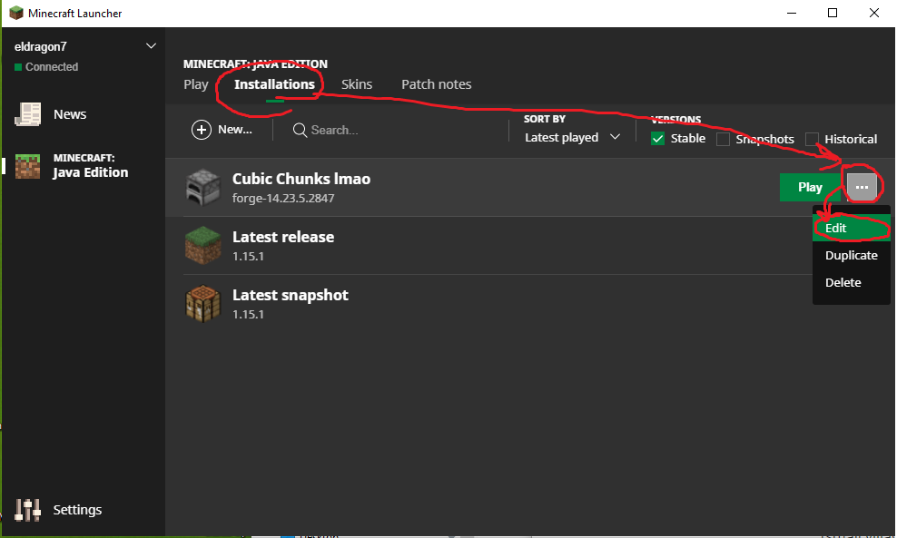
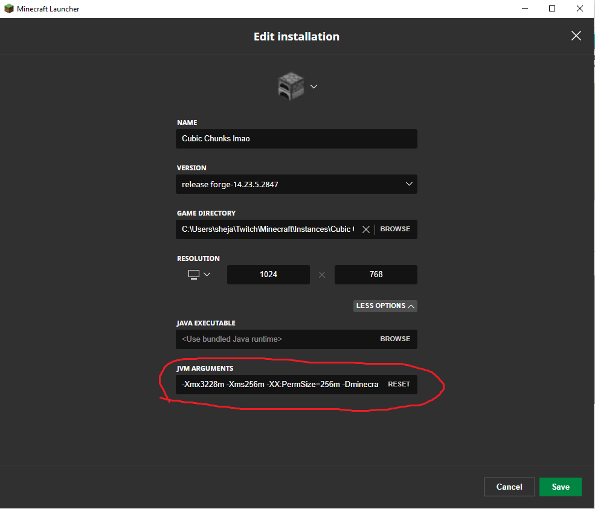
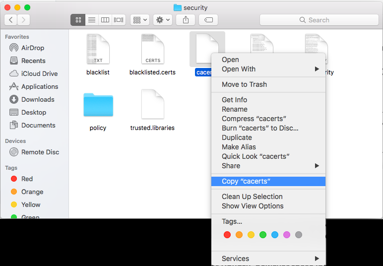

# Building Troubleshooting
### If you do not reach BUILD SUCCESSFUL during the building process
Most likely the Workspace was not created properly, or the build cache is on automatic garbage collection mode. You can try building the DecompWorkspace with an external cache (the workspace to allow code modification with referneces to outside libraries, and seeing if that allows the mod to compile by doing:

On Windows:

```bash
gradlew.bat setupDecompWorkspace 
```
On macOS/Linux
```bash
./gradlew setupDecompWorkspace
```
and try rebuilding by using:

On Windows:

```bash
gradlew.bat build -g TEST_CACHE_BUILD
```
On macOS/Linux:
```bash
./gradlew build -g TEST_CACHE_BUILD
```


# In-game/running Troubleshooting

When running the mod, we always recommend to keep your game's log open at all times during game operation, many times an issue is occuring extremely early, but you won't actually see it in game until the game crashes, or things start to break. Most issues are caught in an Exception, and get printed to the game's log. By default the new CEFClient-based Launcher (the older Java-based launcher did not) that Minecraft now uses disables the log when running by default (also it closes itself, when you click play, also unhelpful when problems occur).

To enable the game log:

Find the Launcher settings:



Enable the option "Open output log when games start":


Keeping the Launcher open is also extremely helpful at times, and we recommend you enable that too, although its not neccessary

**Remember to scroll down to see the most recent output, by default the log doesn't auto-scroll, and will auto-scroll when the log is scrolled to the bottom manually**

### Where on earth am I?

As of current, when you spawn you will not be anywhere near any real-world position, also called Null Island. You will need to first teleport yourself to a world location.

You can use some of our [Cool locations](COOL_LOCATIONS.md) to find somewhere interesting to teleport to.


### Features like roads or trees not spawning / "...download failed, ...will not spawn ..., javax.net.ssl.SSLHandshakeException: ..."

This is an issue with older Java versions that do not know the proper SSL certificates to access some of the online databases used by this mod. Unfortunately, this includes minecraft's bundled Java runtime.

Unfortunately, this means that you should download your own [JRE (Java Runtime Enviroment)](https://www.java.com/ES/download/) if you don't have one already (Veteran's should have no such difficulties as this used to be a requirement for minecraft vanilla).

If you already have a JRE you should locate it on [Windows](#finding-jres-on-windows), [Mac](#finding-jres-on-mac), or [Linux](#switching-jres-on-linux) which has it's own method.

Once you find them, just put that full path to the JRE adding the terms "/bin/java" on the end (or "\bin\javaw.exe" if you are on Windows) (TODO: shejean, add photos/context)

If this still does not work there is an [alternative method](#switching-jvm-certifications-on-windows)


### Finding JREs on Windows

On Windows (vista or later), you can tell if you have other JVMs installed if you search "java" using the Windows search and if anything comes up at all:



If you select the "Configure Java" options this will open your system-wide Java installations, under the "Java" tab in that window, click "View"





You will see every major JVM you have installed to your machine. Copy the path up to the "**\bin**" part (don't include the bin). (If you have multiple choose the newest under the 1.8 jurisdiction).

Then use WINDOWS+R and paste the path you copied, you should now arrive at that folder in Windows Explorer (skip to switching JVM)

### Finding JREs on Mac

It is the same instructions as on Windows, but instead of searching for "java", in your Windows search, instead look for "Java" in your "System Preferences" application:



Clicking on that, will open a seperate java application window, similar to that on Windows, under the "Java" tab, click view:





**Make sure you copy the Path up to the /bin part (don't include the bin), it is way too long to be located through normal means, and is hidden in the system files, so it must be copied in**

Open your finder and use the COMMAND+SHIFT+G shortcut, and paste the path into the box and go the the folder.


Re-open Minecraft, then create a new world with the Planet Earth generator, you should now have roads. 

## "java.lang.NoSuchFieldError" for a func number or a missing biome
This error seems to originate with an uncompleted reference build, although Gradle will finish Building and the build will be successful, when it comes to run the mod, it Gradle builds with placeholder locations for references to other neccessary code, such as the code for Minecraft itself (like Biome information).

A good work around is to setup the Decompiliation cache on your system for Minecraft Forge Gradle, which decompiles Minecraft, Forge, and any extra libraries (the stuff in the lib folder). Normally just building should not need this step, unless you are intending to change the code of the mod, but it is a common workaround to this issue:

If you are on Windows:
```bash
gradlew.bat setupDecompWorkspace
```
If you are on macOS or Linux:
```bash
./gradlew setupDecompWorkspace
```
The build with the same commands as before:

If you are on Windows:
```bash
gradlew.bat build
```
If you are on macOS or Linux:
```bash
./gradlew build
```

## " java.lang.OutOfMemoryError: GC overhead limit exceeded", what is that, how do I fix?
Bro no one's gonna have this error, wny you write so much - orangeadam3
You exceeded the amount of memory that the JVM (Minecraft's running environment) has to use, there are a lot of chunks in the cubic space, and a lot of blocks in those chunks. Especially considering that you will most likely be moving great lengths to get anywhere, you will a lot of memory available to the game to run properly. You can edit the JVM's memory allocation by changing the JVM arguments when it starts:

### JVM Arguments For the Client

Inside of Minecraft's Launcher, go to the Installations tab, find your installation of Forge, and select Edit:



Select **"More Options"**, and find the **"JVM Arguments"** section:



### JVM arguments For the Server

You will need change the launch command when opening your server, as listed in our [Server Run Instructions](USING_SERVER.md), an easy way is to create a "**.bat**" file in Windows, a "**.command**" file in Mac, or a "**.sh**" file in Linux in the same directory as the Forge Server and add this line:

```bash
<JAVA_HOME>/bin/java -Xmx####(suffix) -jar forge-<MCVERSION>-<FORGEVERSION>.jar
```


### -Xmx nomenclature for JVM arguments

Adding or changing the following value:

```
-Xmx####(suffix)
```
will change the amount of RAM that the JVM can use. **(Remember using a capital letter as the suffix is different from using a lowercase letter)**:

**-Xmx1G** is 1 gigabyte

**-Xmx8G** is 8 gigabytes

**-Xmx16G** is 16 gigabytes

......and so on.

However,

**-Xmx1g** is 1 gigabit (125 Megabytes)

**-Xmx8g** is 8 gigabit (1 Gigabyte)

**-Xmx16g** is 16 gigabit (2 Gigabytes, default Minecraft memory)
......and so on.


### Switching JVM certifications on Windows

Travel to the folder you copied, inside of that folder, find the ""**lib**" folder, then "**security**", inside of that should exist a file called "**cacerts**", if it doesn't exist try installing another JVM (like the one we have above), or using another one installed to your machine (if you have more than one).

Once you have confirmed that **cacerts** is existent. You need to justify to Minecraft's JVM to use that cacerts:

Inside your Minecraft Launcher, go to the "Installations" tab, find your Forge installation, and select "Edit":


Select **"More Options"**, and find the **"JVM Arguments"** section:


Inside the JVM Arguments add the following line (ensure there is a space before and after):

On Windows:

```bash
-Djavax.net.ssl.trustStore="<JVMwithoutBin>\lib\security\cacerts"
```

On Mac:

```bash
-Djavax.net.ssl.trustStore=<JVMwithoutBin>/lib/security/cacerts
```

Replace the *<JVMwithoutBin>* area with your copied Path, then click save.

Re-open Minecraft, then create a new world with the Planet Earth generator, you should now have roads.

### Copying "cacerts" into the standard Minecraft Java Executable on Mac

Due to file permissions associated with standard Java installations on Mac, only the executable associated with a specific JVM installed can access it's own "cacerts" file, however, the user can copy and paste files between locations, such as the "cacerts" file itself. 

Travel to the folder you copied (COMMAND+SHIFT+G and paste the directory), inside of that folder, find the ""**lib**" folder, then "**security**", inside of that should exist a file called "**cacerts**", copy this file (DO NOT CUT, using Right click, then copy "cacerts" ensures it is copied).

 

After that, Go to your JVM that is stored in the Minecraft files, the default installation directory is:

```bash
~/Library/Application Support/minecraft/runtime/jre-x64/jre.bundle/Contents/Home/
```

enter the "**lib**" folder, then find the "**security**" folder, and find your existing "**cacerts**" file. RENAME (do not delete) this file to anything but its existing name (something like "**cacerts_old**" is a good way to remember what it was supposed to be).

Then right-click and select "**Paste Item**", you should now have the cacerts file copied from your other JVM into this folder.

Re-open Minecraft, then create a new world with the Planet Earth generator, you should now have roads.

### Switching JREs on Linux

Minecraft by default on Linux does not actually install its own version of JVM like Windows and Mac, it utilizes whatever your **JAVA_HOME** is set to to run Minecraft, you might need to change it to another edition if it doesn't seem to be working.

**The following instructions are written for Ubuntu, however these instructions should work to some degree on all Linux environments**

Running the following command will give you all of your Java installation directories as recognized by the Ubuntu lib installations

```bash
sudo update-alternatives --list java
```

Find a version called java-8, if you do not have it, use the Java Download from above, or run the command in Ubuntu:

```bash
sudo apt-get install openjdk-8-jre-headless
```

then test if you now have a java-8 installation.

After having a java-8 installation, run this command:

```bash
sudo update-alternatives --config java
```

and select the "selection number" associated with the java-8 installation.

Your **JAVA_HOME** should move to that version, and should utilize that one's certificates.
